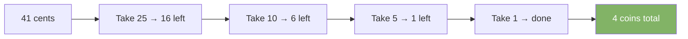

# Greedy Algorithms

Make the best local choice at each step. Never look back. Works when local best choices add up to a global best solution.

---

## Intuition

Greedy is the impatient cousin of dynamic programming. It picks the best option right now without considering all future possibilities. It is faster and simpler than DP, but only correct for certain problems.

---

## Sample Input

```
Coins: [25, 10, 5, 1], amount = 41
Activity selection: start=[1,2,4,6,5], end=[3,5,6,8,9]
```

---

## Visual Representation — Coin Change (Greedy)



---

## Step-by-step Trace — Activity Selection

Sort activities by end time. Always pick the earliest-finishing activity that doesn't conflict.

Activities sorted by end: A(1-3), B(2-5), C(4-6), D(6-8), E(5-9)

| Step | Activity | Start | End | lastEnd | Pick? |
|------|----------|-------|-----|---------|-------|
| 1 | A | 1 | 3 | 0 | Yes → lastEnd=3 |
| 2 | B | 2 | 5 | 3 | No — 2 < 3, conflicts |
| 3 | C | 4 | 6 | 3 | Yes → lastEnd=6 |
| 4 | D | 6 | 8 | 6 | Yes → lastEnd=8 |
| 5 | E | 5 | 9 | 8 | No — 5 < 8, conflicts |

Result: A, C, D — 3 activities (maximum possible)

---

## Java Implementation

### Coin Change (standard denominations)

```java
// Time: O(n log n)  Space: O(1)
int coinChangeGreedy(int[] coins, int amount) {
    Arrays.sort(coins);
    int count = 0;
    for (int i = coins.length - 1; i >= 0 && amount > 0; i--) {
        count += amount / coins[i];
        amount %= coins[i];
    }
    return amount == 0 ? count : -1;
}
// Works for [25,10,5,1]. Fails for arbitrary denominations like [1,3,4].
```

### Activity Selection

```java
// Time: O(n log n)  Space: O(n)
int maxActivities(int[] start, int[] end) {
    int n = start.length;
    Integer[] idx = new Integer[n];
    for (int i = 0; i < n; i++) idx[i] = i;
    Arrays.sort(idx, (a, b) -> end[a] - end[b]); // sort by end time

    int count = 1, lastEnd = end[idx[0]];
    for (int i = 1; i < n; i++)
        if (start[idx[i]] >= lastEnd) {
            count++;
            lastEnd = end[idx[i]];
        }
    return count;
}
```

### Jump Game

```java
// Time: O(n)  Space: O(1)
boolean canJump(int[] nums) {
    int maxReach = 0;
    for (int i = 0; i < nums.length; i++) {
        if (i > maxReach) return false;
        maxReach = Math.max(maxReach, i + nums[i]);
    }
    return true;
}
// [2,3,1,1,4] → true   [3,2,1,0,4] → false
```

---

## Common Mistakes

- **Applying greedy to arbitrary coin denominations.** Greedy coin change only works with canonical coin systems (like [1,5,10,25]). For coins like [1,3,4], greedy gives 3 coins for amount=6 (4+1+1) but DP finds 2 (3+3). Use DP for arbitrary coins.
- **Not sorting before applying greedy.** Most greedy algorithms require sorted input. Forgetting the sort step produces wrong answers.
- **Confusing greedy with DP.** If the greedy choice at step 3 depends on what you chose at step 1, it is not a greedy problem — it needs DP.
- **Assuming greedy always works.** Always prove (or verify with examples) that the greedy choice property holds for your specific problem.

---

## Practice Problems

| Difficulty | Problem | Link |
|------------|---------|------|
| Medium | Jump Game | [LeetCode 55](https://leetcode.com/problems/jump-game/) |
| Medium | Merge Intervals | [LeetCode 56](https://leetcode.com/problems/merge-intervals/) |
| Medium | Task Scheduler | [LeetCode 621](https://leetcode.com/problems/task-scheduler/) |

---

## Deep Dive

### Greedy vs Dynamic Programming

| Property | Greedy | Dynamic Programming |
|----------|--------|-------------------|
| Makes | Local optimal choice | Considers all choices |
| Looks back | Never | Yes — uses past results |
| Speed | Faster — usually O(n log n) | Slower — usually O(n²) |
| Space | O(1) or O(n) | Usually O(n) or O(n²) |
| Correctness | Only for certain problems | Always correct if modeled right |

### Classic Greedy Problems

| Problem | Greedy Strategy |
|---------|----------------|
| Activity selection | Pick earliest end time |
| Fractional knapsack | Pick highest value/weight ratio |
| Huffman encoding | Merge two least frequent nodes |
| Dijkstra | Always process minimum distance vertex |
| Jump game | Track maximum reachable index |
