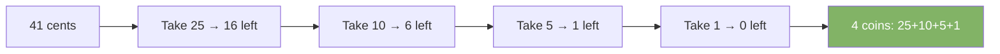
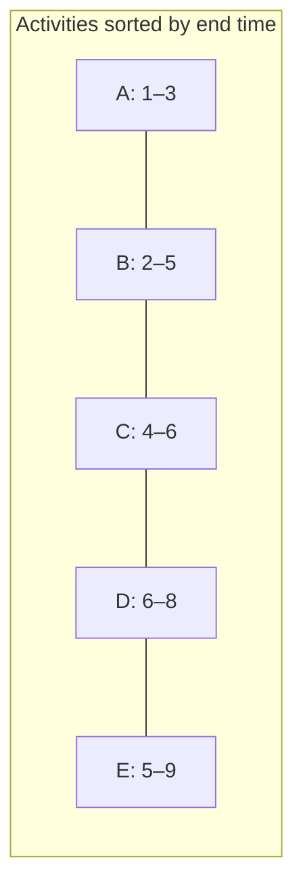

# Greedy Algorithms

A greedy algorithm makes the locally optimal choice at each step. It never looks back. It works when the local best choice leads to a global best solution.

---

## Key Insight

Greedy is simpler and faster than DP. It does not explore all options. But it only works when a "greedy choice property" holds — the greedy pick at each step is always part of the optimal solution.

---

## Example 1 — Coin Change (Greedy, with standard denominations)

Given coins [25, 10, 5, 1], make change for 41 cents with fewest coins.



```java
int coinChangeGreedy(int[] coins, int amount) {
    Arrays.sort(coins);
    int count = 0;
    for (int i = coins.length - 1; i >= 0 && amount > 0; i--) {
        count += amount / coins[i];
        amount %= coins[i];
    }
    return amount == 0 ? count : -1;
}
```

> Greedy works here with standard denominations. It fails with arbitrary coins like [1, 3, 4] for amount=6 — greedy picks 4+1+1=3 coins, but 3+3=2 coins is optimal. Use DP for arbitrary coins.

---

## Example 2 — Activity Selection

Pick the maximum number of non-overlapping activities.



Greedy: always pick the activity that finishes earliest.

```java
int maxActivities(int[] start, int[] end) {
    int n = start.length;
    Integer[] idx = new Integer[n];
    for (int i = 0; i < n; i++) idx[i] = i;
    Arrays.sort(idx, (a, b) -> end[a] - end[b]); // sort by end time

    int count = 1, lastEnd = end[idx[0]];
    for (int i = 1; i < n; i++) {
        if (start[idx[i]] >= lastEnd) {
            count++;
            lastEnd = end[idx[i]];
        }
    }
    return count;
}
```

---

## Example 3 — Jump Game

Can you reach the last index? Each element is the max jump length from that position.

```java
boolean canJump(int[] nums) {
    int maxReach = 0;
    for (int i = 0; i < nums.length; i++) {
        if (i > maxReach) return false;    // can't reach index i
        maxReach = Math.max(maxReach, i + nums[i]);
    }
    return true;
}
// [2,3,1,1,4] → true
// [3,2,1,0,4] → false
```

---

## Example 4 — Minimum Platforms (Train Station)

Find the minimum number of platforms needed so no train waits.

```java
int minPlatforms(int[] arrival, int[] departure) {
    Arrays.sort(arrival);
    Arrays.sort(departure);
    int platforms = 1, max = 1;
    int i = 1, j = 0;
    while (i < arrival.length && j < departure.length) {
        if (arrival[i] <= departure[j]) {
            platforms++;
            i++;
        } else {
            platforms--;
            j++;
        }
        max = Math.max(max, platforms);
    }
    return max;
}
```

---

## Greedy vs Dynamic Programming

| Property             | Greedy                     | Dynamic Programming         |
|----------------------|----------------------------|-----------------------------|
| Choice               | Local optimum              | All possible choices        |
| Looks back           | Never                      | Yes — uses past results     |
| Speed                | Faster                     | Slower                      |
| Correctness          | Only for certain problems  | Always correct if modeled right |
| Space                | O(1) or O(n)               | Usually O(n) or O(n²)       |

---

## Classic Greedy Problems

| Problem                       | Greedy Strategy                              |
|-------------------------------|----------------------------------------------|
| Activity selection            | Pick activity with earliest end time         |
| Fractional knapsack           | Pick item with highest value/weight ratio    |
| Huffman encoding              | Merge two least frequent nodes               |
| Dijkstra shortest path        | Always process minimum distance vertex       |
| Prim's MST                    | Always pick minimum edge to unvisited vertex |
| Kruskal's MST                 | Sort edges, add if no cycle                  |
| Jump game                     | Track maximum reachable index                |
