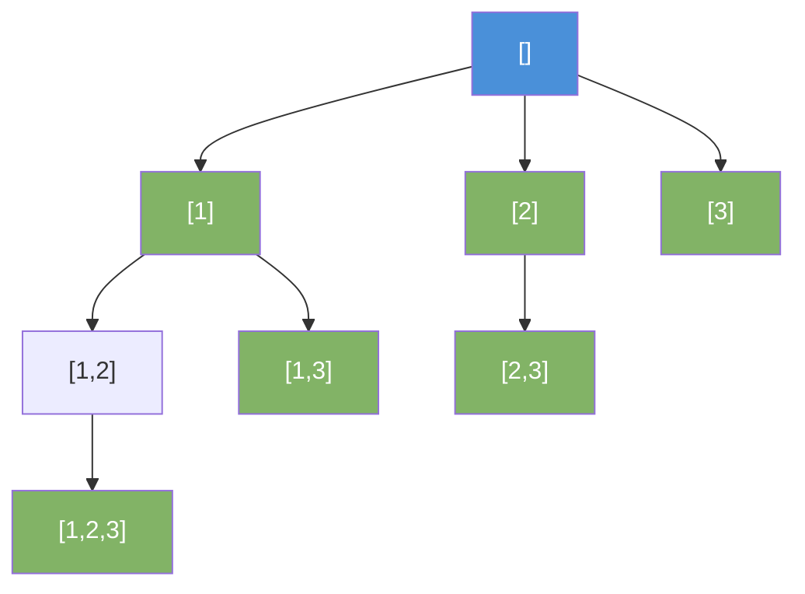

# Backtracking

Build solutions incrementally. When a partial solution cannot lead to a valid answer, abandon it and try the next option.

---

## Intuition

Backtracking is a controlled brute force. It explores every possible path in a decision tree. At each step, it picks a choice and goes deeper. When a dead end is reached, it undoes the last choice and tries the next one. Pruning cuts off branches early when they can't possibly lead to a solution.

---

## Sample Input

```
Subsets of [1, 2, 3]
Permutations of [1, 2, 3]
```

---

## Visual Representation — Subsets of [1, 2, 3]



---

## Step-by-step Trace — Subsets of [1, 2, 3]

| Call | current | Add to result | Choose next |
|------|---------|---------------|-------------|
| backtrack(0) | [] | [] | try 1, 2, 3 |
| backtrack(1) | [1] | [1] | try 2, 3 |
| backtrack(2) | [1,2] | [1,2] | try 3 |
| backtrack(3) | [1,2,3] | [1,2,3] | done → backtrack |
| back to [1,2] | [1,2] | — | done → backtrack |
| backtrack(3) | [1,3] | [1,3] | done → backtrack |
| back to [1] | [1] | — | done → backtrack |
| backtrack(2) | [2] | [2] | try 3 |
| backtrack(3) | [2,3] | [2,3] | done → backtrack |
| backtrack(3) | [3] | [3] | done |

Result: [], [1], [1,2], [1,2,3], [1,3], [2], [2,3], [3]

---

## Java Implementation

### Template

```java
void backtrack(State current, List<Solution> results) {
    if (isSolution(current)) {
        results.add(new Solution(current));
        return;
    }
    for (Choice choice : getChoices(current)) {
        if (isValid(choice)) {
            makeChoice(choice);      // choose
            backtrack(current, results);
            undoChoice(choice);      // un-choose (backtrack)
        }
    }
}
```

### Subsets

```java
// Time: O(2ⁿ)  Space: O(n)
List<List<Integer>> subsets(int[] nums) {
    List<List<Integer>> result = new ArrayList<>();
    backtrack(nums, 0, new ArrayList<>(), result);
    return result;
}

void backtrack(int[] nums, int start, List<Integer> current, List<List<Integer>> result) {
    result.add(new ArrayList<>(current));
    for (int i = start; i < nums.length; i++) {
        current.add(nums[i]);
        backtrack(nums, i + 1, current, result);
        current.remove(current.size() - 1);
    }
}
```

### Permutations

```java
// Time: O(n!)  Space: O(n)
void backtrack(int[] nums, boolean[] used, List<Integer> current, List<List<Integer>> result) {
    if (current.size() == nums.length) {
        result.add(new ArrayList<>(current));
        return;
    }
    for (int i = 0; i < nums.length; i++) {
        if (used[i]) continue;
        used[i] = true;
        current.add(nums[i]);
        backtrack(nums, used, current, result);
        current.remove(current.size() - 1);
        used[i] = false;
    }
}
```

### Combination Sum (with pruning)

```java
// Time: O(2^(amount/min_coin))  Space: O(amount/min_coin)
void backtrack(int[] candidates, int remaining, int start, List<Integer> current, List<List<Integer>> result) {
    if (remaining == 0) { result.add(new ArrayList<>(current)); return; }
    for (int i = start; i < candidates.length; i++) {
        if (candidates[i] > remaining) break; // pruning — sorted array
        current.add(candidates[i]);
        backtrack(candidates, remaining - candidates[i], i, current, result);
        current.remove(current.size() - 1);
    }
}
```

---

## Common Mistakes

- **Forgetting to undo the choice.** After the recursive call, you must remove what you added. Without un-choosing, the `current` list carries over to the next branch and produces wrong results.
- **Adding `current` directly to result.** Always add a copy: `result.add(new ArrayList<>(current))`. Adding the reference means all stored solutions point to the same list and get overwritten.
- **Not pruning.** Without `if (candidates[i] > remaining) break`, every invalid branch is fully explored. Pruning can cut runtime from O(2ⁿ) to much less.
- **Incorrect start index for combinations.** For subsets/combinations, pass `i + 1` as the start index to avoid reusing the same element. For permutations, always start from 0 and use a `used[]` array.

---

## Practice Problems

| Difficulty | Problem | Link |
|------------|---------|------|
| Medium | Subsets | [LeetCode 78](https://leetcode.com/problems/subsets/) |
| Medium | Permutations | [LeetCode 46](https://leetcode.com/problems/permutations/) |
| Hard | N-Queens | [LeetCode 51](https://leetcode.com/problems/n-queens/) |

---

## Deep Dive

### Pruning — The Key to Efficiency

Without pruning, backtracking is exhaustive brute force. With pruning, it skips branches that cannot possibly produce valid solutions. For N-Queens on an 8×8 board: brute force checks 8^8 = 16 million placements. With pruning, backtracking checks ~92 valid configurations and only a few thousand branches. Pruning is what makes backtracking practical.

### Backtracking Problems by Type

| Problem | What to choose | When to prune |
|---------|---------------|---------------|
| Subsets | Include or skip item | Rarely needed |
| Permutations | Next unused element | When element already used |
| Combination sum | Next candidate | When sum exceeds target |
| N-Queens | Column for each row | Column or diagonal conflict |
| Sudoku solver | Digit for empty cell | Digit already in row/col/box |
| Word search | Adjacent cell | Out of bounds or already visited |
