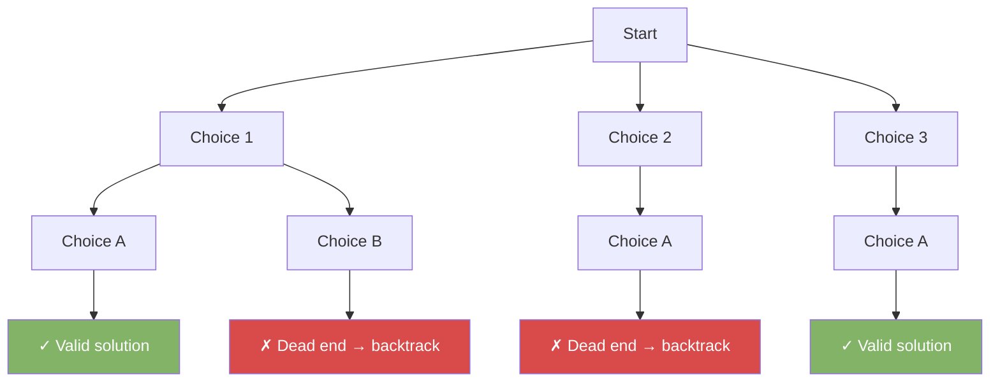
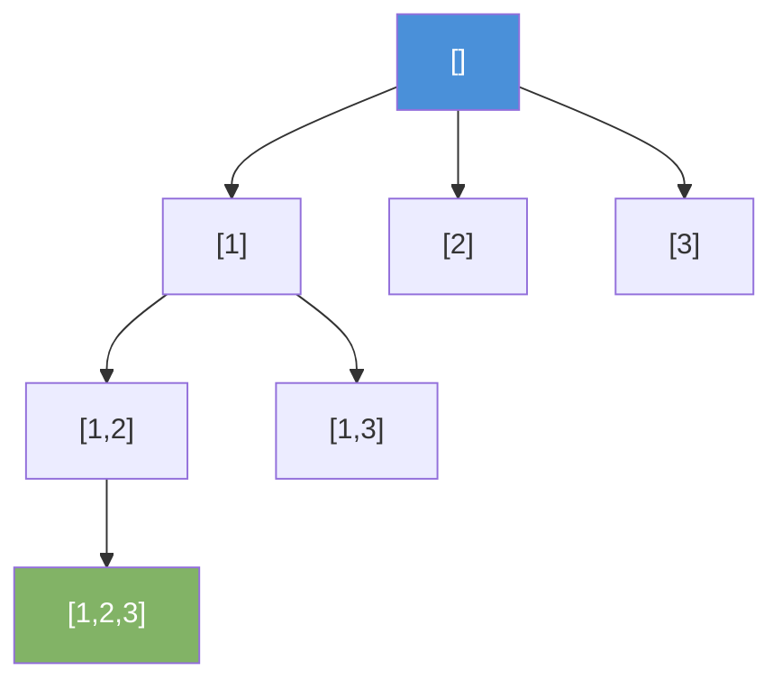

# Backtracking

Backtracking explores all possible solutions by building them incrementally. When a partial solution cannot lead to a valid answer, it abandons it and steps back (backtracks) to try a different path.

---

## How It Works



---

## Template

```java
void backtrack(State current, List<Solution> results) {
    if (isSolution(current)) {
        results.add(new Solution(current));
        return;
    }
    for (Choice choice : getChoices(current)) {
        if (isValid(choice, current)) {
            makeChoice(choice, current);      // choose
            backtrack(current, results);      // explore
            undoChoice(choice, current);      // un-choose (backtrack)
        }
    }
}
```

---

## Example 1 — Subsets

Generate all subsets of `[1, 2, 3]`.



```java
List<List<Integer>> subsets(int[] nums) {
    List<List<Integer>> result = new ArrayList<>();
    backtrack(nums, 0, new ArrayList<>(), result);
    return result;
}

void backtrack(int[] nums, int start, List<Integer> current, List<List<Integer>> result) {
    result.add(new ArrayList<>(current));
    for (int i = start; i < nums.length; i++) {
        current.add(nums[i]);           // choose
        backtrack(nums, i + 1, current, result);
        current.remove(current.size() - 1); // un-choose
    }
}
// Output: [], [1], [1,2], [1,2,3], [1,3], [2], [2,3], [3]
```

---

## Example 2 — Permutations

Generate all permutations of `[1, 2, 3]`.

```java
List<List<Integer>> permutations(int[] nums) {
    List<List<Integer>> result = new ArrayList<>();
    backtrack(nums, new boolean[nums.length], new ArrayList<>(), result);
    return result;
}

void backtrack(int[] nums, boolean[] used, List<Integer> current, List<List<Integer>> result) {
    if (current.size() == nums.length) {
        result.add(new ArrayList<>(current));
        return;
    }
    for (int i = 0; i < nums.length; i++) {
        if (used[i]) continue;
        used[i] = true;
        current.add(nums[i]);
        backtrack(nums, used, current, result);
        current.remove(current.size() - 1);
        used[i] = false;
    }
}
// Output: [1,2,3], [1,3,2], [2,1,3], [2,3,1], [3,1,2], [3,2,1]
```

---

## Example 3 — N-Queens

Place N queens on an N×N board so no two queens attack each other.

```java
List<List<String>> solveNQueens(int n) {
    List<List<String>> result = new ArrayList<>();
    int[] queens = new int[n]; // queens[row] = col
    Arrays.fill(queens, -1);
    backtrack(queens, n, 0, result);
    return result;
}

void backtrack(int[] queens, int n, int row, List<List<String>> result) {
    if (row == n) {
        result.add(buildBoard(queens, n));
        return;
    }
    for (int col = 0; col < n; col++) {
        if (isValid(queens, row, col)) {
            queens[row] = col;
            backtrack(queens, n, row + 1, result);
            queens[row] = -1;
        }
    }
}

boolean isValid(int[] queens, int row, int col) {
    for (int r = 0; r < row; r++) {
        if (queens[r] == col) return false;                    // same column
        if (Math.abs(queens[r] - col) == Math.abs(r - row)) return false; // same diagonal
    }
    return true;
}

List<String> buildBoard(int[] queens, int n) {
    List<String> board = new ArrayList<>();
    for (int r = 0; r < n; r++) {
        char[] row = new char[n];
        Arrays.fill(row, '.');
        row[queens[r]] = 'Q';
        board.add(new String(row));
    }
    return board;
}
```

---

## Example 4 — Combination Sum

Find all combinations that sum to a target.

```java
List<List<Integer>> combinationSum(int[] candidates, int target) {
    List<List<Integer>> result = new ArrayList<>();
    Arrays.sort(candidates);
    backtrack(candidates, target, 0, new ArrayList<>(), result);
    return result;
}

void backtrack(int[] candidates, int remaining, int start, List<Integer> current, List<List<Integer>> result) {
    if (remaining == 0) {
        result.add(new ArrayList<>(current));
        return;
    }
    for (int i = start; i < candidates.length; i++) {
        if (candidates[i] > remaining) break; // pruning
        current.add(candidates[i]);
        backtrack(candidates, remaining - candidates[i], i, current, result);
        current.remove(current.size() - 1);
    }
}
```

---

## Pruning

Pruning cuts branches early when they cannot possibly lead to a valid solution. It is the key to making backtracking efficient.

```java
if (candidates[i] > remaining) break; // no point going further — sorted array
```

---

## Common Backtracking Problems

| Problem               | What to Choose        | When to Prune               |
|-----------------------|-----------------------|-----------------------------|
| Subsets               | Include/exclude item  | Rarely needed               |
| Permutations          | Next unused element   | When element already used   |
| Combination sum       | Next candidate        | When sum exceeds target     |
| N-Queens              | Column for each row   | Column or diagonal conflict |
| Sudoku solver         | Digit for empty cell  | Digit already in row/col/box|
| Palindrome partition  | Split point           | Substring not palindrome    |
| Word search in grid   | Adjacent cell         | Cell visited or out of bounds|
